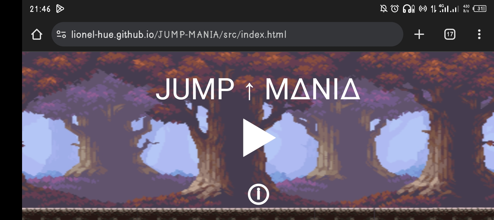
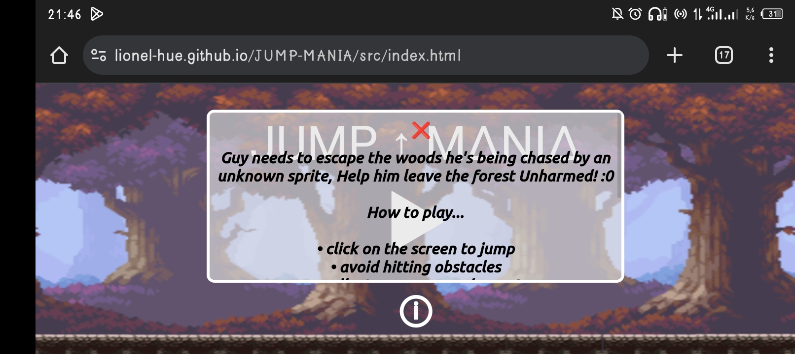
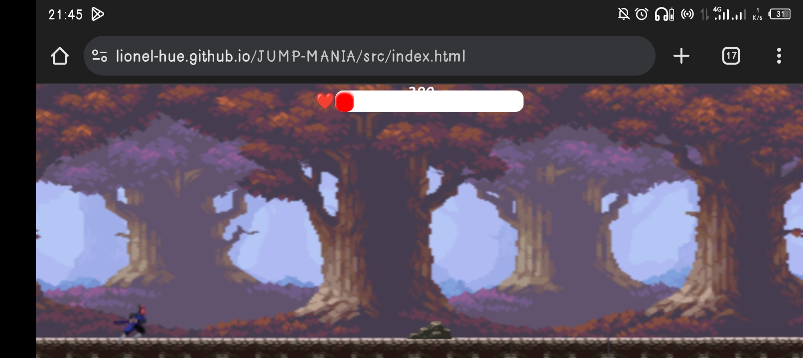
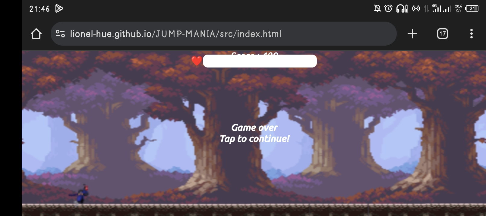

# 
JUMP MAINIA!

> #### Jump mania is a simple endless runner gui made with vanilla js and the oop concept.
> #### 
   
 

> ## Trivia 
> #### Guy needs to escape the woods as he is being chased by an unknown sprite!, Help him escape unharmed

> ## In game features
> - #### Soft and simple gui
> - #### In game music
> - #### Health powerup 

> ## NOTE !
> #### This game is built for mobile  and might not work properly on desktop.   

> ## Click here to <a href="https://lionel-hue.github.io/JUMP-MANIA/src/index.html">play</a>